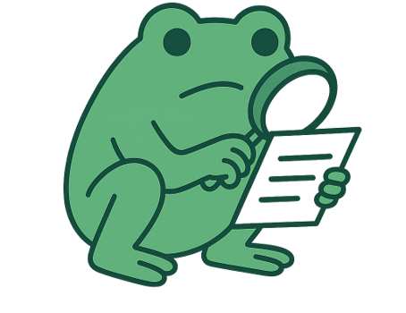

<div align="center">


# ️  <br> AntiCheetos

**Preventive Academic Fraud Tool**

_Bachelor's Thesis · Degree in Cybersecurity Engineering · URJC · 2025/2026_

**Author:** [@SapoPepe](https://github.com/SapoPepe) &nbsp;|&nbsp; **Tutor:** [@rmartinsanta](https://github.com/rmartinsanta)

</div>

---

## Table of Contents

- [What is AntiCheetos?](#-what-is-anticheetos)
- [System Requirements](#-system-requirements)
- [Installation and Deployment](#-installation-and-deployment)
- [Execution](#-execution)
- [Modules](#modules)
  - [Module 1 – Code](#module-1--code)
  - [Module 2 – CTF Flags](#module-2--ctf-flags)
  - [Module 3 – Image Similarity Analysis](#module-3--image-similarity-analysis)
- [Future Work](#future-work)
- [License](#license)
- [Acknowledgments](#acknowledgments)

---

## 🐸 What is AntiCheetos?

 **AntiCheetos** is an application that centralizes and automates the detection of copying and academic fraud in university environments.

It is currently specialized for the **Cybersecurity Engineering Degree** at URJC. Its analysis algorithms are designed to be highly accurate, always prioritizing maintaining a **low false-positive rate**.

---

## ⚙️ System Requirements

| Component            | Minimum Version | Notes |
|:---------------------| :---: | :--- |
| **Java JDK**         | `21+` | Required for modern language features. |
| **Maven**            | `3.x+` | Used to build the project and manage dependencies. |
| **Perl**             | `5.x` | Required for the Stanford MOSS client script. |
| **MOSS Account**     | — | Free registration at [moss.stanford.edu](https://theory.stanford.edu/~aiken/moss/). |
| ️**DOMjudge Access** | — | Deployed with API enabled and Single Sign-On (SSO). |
| **CTFd API Key**     | — | Access key generated from the administration panel. |

---

## 🚀 Installation and Deployment

Clone the repository and build the project using **Maven**:

```bash
# 1. Build the project to create the executable file
mvn clean package

# 2. Ensure the Perl script has execution permissions
chmod +x moss.pl
```

---

## 💻 Execution

> [!WARNING]
> Due to the architecture of **OpenCV** under Java 21, it is mandatory to provide native access and unsafe memory permissions to the JVM if you plan to use **SIFT Analysis**.

Execute the packaged tool with the following command:

```bash
java -jar anticheetos.jar --enable-native-access=ALL-UNNAMED --sun-misc-unsafe-memory-access=allow
```

---

## Modules

### Module 1 – Code

Direct integration with the [MOSS](https://theory.stanford.edu/~aiken/moss/) forensic service from Stanford University. It extracts student submissions through the [DOMjudge](https://www.domjudge.org/) API and automates the comparative analysis to detect structural similarities in the code.

* **Supported languages:** `C`, `Java`, `Python`, `Assembly`, and +25 more.
* **Specific requirements:**
  * [Perl](https://strawberryperl.com/) script configured with your MOSS *UserId*.
  * DOMjudge must be deployed with Single Sign On.

<details>
<summary><b>Output example</b></summary>

```text
Submisions result of "No more TV" [python]
Files to analyse: 47
Cheching files...
OK
Query submited. Waiting for the server's response.
http://moss.standford.edu/results/X/XXXXXXX
```
</details>

---

### Module 2 – CTF Flags

Connects with your [CTFd](https://ctfd.io/) deployment to correlate submissions. Using a rigorous algorithm, it audits whether a student has submitted a *dynamic flag* generated for another classmate's challenge (or if they bypassed the *regex* in an unauthorized way to skip the challenge).

<details>
<summary><b>Output example</b></summary>

```java
FlagCopied[copycat=null, id_userA=178, userA=TestUser1, id_userB=null, userB=null, id_challenge=36, challenge=Alliespre, flag=URJC{C1b3r_C1b3r_C1b3r_0000000000}]
FlagCopied[copycat=TestUser2, id_userA=178, userA=TestUser1, id_userB=179, userB=TestUser2, id_challenge=37, challenge=FlagGPT, flag=URJC{My_t001_br0k3_26a48be496}] 
```
</details>

---

### Module 3 – Image Similarity Analysis

Designed to detect the reuse of graphic material (screenshots, diagrams, charts, photographs) in `.pdf` and `.docx` documents submitted by students. Analyzes at **3 depth levels:**

1. **Level 1 - Full File:** `H_file = SHA1(File_bytes)`. Detects exact binary copies (includes metadata).
2. **Level 2 - Pixel Matrix:** `H_pixel = SHA1(BitMatrix(Image))`. Detects visually identical images even if the container format changes.
3. **Level 3 - PHash + SIFT:** Identifies rotated, cropped, resized, compressed images, or with brightness adjustments. Uses the **OpenCV** engine.

> [!NOTE]
> **Required Directory Structure:**
> Each student must have their own folder within the evaluation directory to isolate their documents.
> ```text
> 📁 Desktop/Submissions/
> ├── 📁 Jose_Perez
> |    └── 📄 entrega-1.pdf
> ├── 📁 Adrian_Gonzalez
> |    ├── 📄 anexos.docx
> |    └── 📄 trabajo-3.docx
> └── 📁 Laura_Blanco
>      └── 📄 TFG.pdf 
> ```

<details>
<summary><b>Output example</b></summary>

```java
Match[student=Jose_Perez, hash=6AE229F508E0D, file=C:\Adrian\Desktop\Submissions\Jose_Perez\entrega-1_4.png, otherMatches=[C:\Adrian\Desktop\Submissions\Laura_Blanco\TFG_17.png]]
```
</details>

---

## Future Work

- [ ] **OCR for code images:** Extract typographic text from code screenshots to analyze their logic with MOSS.
- [ ] **Hybrid engine with JPlag:** Inclusion of abstract syntax tree (AST) analysis to catch advanced combined obfuscations.
- [ ] **Graphic UI:** for users that are not used to the terminal interface.
- [ ] **Interactive graphs:** Use the [Mossum](https://github.com/hjalti/mossum) tool to visually display plagiarism connections on the web.
- [ ] **Normal authentication with DOMjudge**: Suppport DOMjudge API authentications by user/pass. SSO will be use as default anyway.
- [ ] **Advanced CLI:** Refactor the main input using Apache Commons CLI:
  ```bash
  java -jar AntiCheetos.jar --domjudge --url https://dj.example.com/jury --cid 5 -u admin -p password
  ```

---

## License

This project is distributed under the **Creative Commons Attribution 4.0 International (CC BY 4.0)** license.  
Read the full text: [View License](https://creativecommons.org/licenses/by/4.0/)

---

## Acknowledgments

I would like to thank my tutor [@rmartinsanta](https://github.com/rmartinsanta) who proposed the initial idea for the development of AntiCheetos, as well as allowing me to use the original code from his [themis](https://github.com/rmartinsanta/themis.git) tool to incorporate it as an image detection module inside AntiCheetos.

<br>

